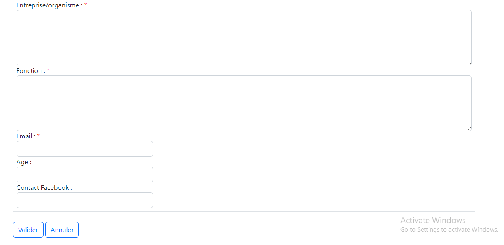
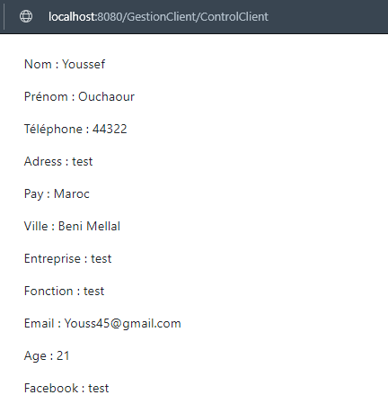
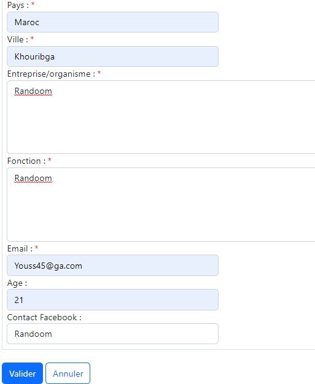

___

<h2 align="center" style="color:red">Sommaire </h2>
<span align="center">

#### ........................................... [Introduction](#cc1)  ...........................................

#### ........................................... [Solutions](#cc2)  ...........................................

#### ........................................... [Conclusion](#cc3) ...........................................

</span>

___


<h2 align="center" style="color:red" id="cc1">I. Introduction</h2>

**Java Server Pages ou JSP est une technique basée sur Java qui permet aux développeurs de créer dynamiquement du code HTML ou tout autre type de page web. Cette technique permet au code Java et à certaines actions prédéfinies d’être ajoutés dans un contenu statique(HTML). et dans ce TP nous allons découvrir des choses sur la technologie JSP, et se familiariser avec les autres anciennes notions dans  JEE.**

___ 

<h2 align="center" style="color:red" id="cc2">II. Résolution de TP</h2>
 

#### <span style="color:green"> Q1 & Q2:</span>
* ##### Créons un nouveau projet Web  *<< GestionClients >>*
* ##### Créons un nouveau fichier *<< index.jsp >>* dans WebContenent  
* 


#### <span style="color:green"> Q3:</span>
> * ##### Le Formulaire 
  *  
> * ##### Le Code
  * 
    ```html
    <%@ page language="java" contentType="text/html; charset=ISO-8859-1" pageEncoding="ISO-8859-1" %>
    <html>
        <head>
            <meta charset="UTF-8">
            <title>FORM</title>
            <!-- CSS only -->
            <link href="https://cdn.jsdelivr.net/npm/bootstrap@5.2.2/dist/css/bootstrap.min.css" rel="stylesheet"
                integrity="sha384-Zenh87qX5JnK2Jl0vWa8Ck2rdkQ2Bzep5IDxbcnCeuOxjzrPF/et3URy9Bv1WTRi" crossorigin="anonymous">
            <!-- JavaScript Bundle with Popper -->
            <script src="https://cdn.jsdelivr.net/npm/bootstrap@5.2.2/dist/js/bootstrap.bundle.min.js"
                integrity="sha384-OERcA2EqjJCMA+/3y+gxIOqMEjwtxJY7qPCqsdltbNJuaOe923+mo//f6V8Qbsw3" crossorigin="anonymous"
                defer></script>
        </head>

        <body>
            <div class="container my-4">
                <h4 class="title" style="color: teal">>>Informations de lauréat:</h4>
                <form action="ControlClient" method="post" class="form">
                    <fieldset class="border p-2">
                        <label for="nom">Nom : <span style="color: red"> *</span></label> <input type="text" name="nom"
                            class="form-control" style="width: 30%;" required /> <label for="prenom">Prénom : <span
                                style="color: red"> *</span></label> <input type="text" name="prenom" class="form-control"
                            style="width: 30%;" required /> <label for="tele">Numéro téléphone : <span style="color: red">
                                *</span></label> <input type="text" name="tele" class="form-control" style="width: 30%;"
                            required /> <label for="adress">Adresse
                            : <span style="color: red"> *</span>
                        </label>
                        <textarea class="form-control" cols="6" rows="5" name="adress"></textarea>
                        <label for="pay">Pays : <span style="color: red"> *</span></label> <input type="text" name="pay"
                            class="form-control" style="width: 30%;" required /> <label for="ville">Ville : <span
                                style="color: red"> *</span></label> <input type="text" name="ville" class="form-control"
                            style="width: 30%;" required /> <label for="etre">Entreprise/organisme : <span
                                style="color: red">
                                *</span></label>
                        <textarea class="form-control" cols="6" rows="5" name="etre"></textarea>
                        <label for="fct">Fonction : <span style="color: red">
                                *</span></label>
                        <textarea class="form-control" cols="6" rows="5" name="fct"></textarea>

                        <label for="email">Email : <span style="color: red">
                                *</span></label> <input type="text" name="email" class="form-control" style="width: 30%;"
                            required /> <label for="age">Age : </label> <input type="text" name="age" class="form-control"
                            style="width: 30%;" />

                        <label for="fb">Contact Facebook : </label> <input type="text" name="fb" class="form-control"
                            style="width: 30%;" />
                    </fieldset>
                    <br>
                    <button name="valider" type="submit" class="btn btn-outline-primary">Valider</button>
                    <button name="annuler" type="reset" class="btn btn-outline-primary">Annuler</button>
                </form>
            </div>
        </body>
    </html>

    ```

#### <span style="color:green"> Q4:</span>
Nous créons la servlet **<< ControlClient >>** qui affiche les donneés saisies par l'utilisateur, a l'aide de l'objet out de class **PrintWriter** et de la methode **getParameter** utilisant la methode **doPost**.

> * ##### L'affichage
  * 

> * ##### Le Code
  * 
    ```java
    package com.ensa.metier;

    import java.io.IOException;
    import java.io.PrintWriter;

    import javax.servlet.ServletException;
    import javax.servlet.annotation.WebServlet;
    import javax.servlet.http.HttpServlet;
    import javax.servlet.http.HttpServletRequest;
    import javax.servlet.http.HttpServletResponse;

    @WebServlet("/ControlClient")
    public class ControlClient extends HttpServlet {

        private static final long serialVersionUID = 1L;

        protected void doGet(HttpServletRequest request, HttpServletResponse response)
                throws ServletException, IOException {

        }

        protected void doPost(HttpServletRequest request, HttpServletResponse response)
            throws ServletException, IOException {
            
            response.setContentType("text/html");
            PrintWriter out = response.getWriter();
            
            String nom = request.getParameter("nom");
            String prenom = request.getParameter("prenom");
            String tele = request.getParameter("tele");
            String adress = request.getParameter("adress");
            String pay = request.getParameter("pay");
            String ville = request.getParameter("ville");
            String etre = request.getParameter("etre");
            String fct = request.getParameter("fct");
            String email = request.getParameter("email");
            String age = request.getParameter("age");
            String fb = request.getParameter("fb");
            out.println("<!DOCTYPE html>\r\n"   //pour afficher les données saisies.
                    + "<html>\r\n"
                    + "<head>\r\n"
                    + "<meta charset=\"UTF-8\">\r\n"
                    + "<title>Resultat</title>\r\n"
                    +"<link rel=\"stylesheet\" href=\"https://cdn.jsdelivr.net/npm/bootstrap@4.0.0/dist/css/bootstrap.min.css\" />"
                    +"<script src=\"https://cdn.jsdelivr.net/npm/bootstrap@5.2.2/dist/js/bootstrap.bundle.min.js\" integrity=\"sha384-OERcA2EqjJCMA+/3y+gxIOqMEjwtxJY7qPCqsdltbNJuaOe923+mo//f6V8Qbsw3\" crossorigin=\"anonymous\" defer></script>"
                    + "</head>\r\n"
                    + "<body>\r\n"
                    +"<div class=\"container my-4\">"
                    +"<p>"+"Nom : "+nom+"<br></p>"
                    +"<p>"+"Prénom : "+prenom+"<br></p>"
                    +"<p>"+"Téléphone : "+tele+"<br></p>"
                    +"<p>"+"Adress : "+adress+"<br></p>"
                    +"<p>"+"Pay : "+pay+"<br></p>"
                    +"<p>"+"Ville : "+ville+ "<br></p>"
                    +"<p>"+"Entreprise : "+etre+"<br></p>"
                    +"<p>"+"Fonction : "+fct+"<br></p>"
                    +"<p>"+"Email : "+email+"<br></p>"
                    +"<p>"+"Age : "+age+"<br></p>"
                    +"<p>"+"Facebook : "+fb+"<br></p>"
                    +"</div>"
                    + "</body>\r\n"
                    + "</html>");
        }
    }
    ```

#### <span style="color:green"> Q5:</span>
afin d'enregistrer les données saisies dans un table relationnelle dans un base de données MYSQL;
* nous allons d'abord créer une table **<< Table_Client >>** dans une base de données **<< Base_Client >>**
* et  il faut crées une connexion entre la servlet **<< ControlClient >>** et notre base de données.

  * 
  * 
* et après insérez les informations dans le formulaire correctement, ils seront enregistré dans la table.

  * 
  * 

> * ##### Le Code
  * 
    ```java
    package com.ensa.metier;

    import java.io.IOException;
    import java.sql.Connection;
    import java.sql.DriverManager;
    import java.sql.SQLException;

    import javax.servlet.ServletException;
    import javax.servlet.annotation.WebServlet;
    import javax.servlet.http.HttpServlet;
    import javax.servlet.http.HttpServletRequest;
    import javax.servlet.http.HttpServletResponse;

    @WebServlet("/ControlClient")
    public class ControlClient extends HttpServlet {

        private static final long serialVersionUID = 1L;
        protected void doGet(HttpServletRequest request, HttpServletResponse response)
                throws ServletException, IOException {
        }

        protected void doPost(HttpServletRequest request, HttpServletResponse response)
            throws ServletException, IOException {
                //nous récupérons les informations du formulaire
            
                String nom = request.getParameter("nom");
                String prenom = request.getParameter("prenom");
                String tele = request.getParameter("tele");
                String adress = request.getParameter("adress");
                String pay = request.getParameter("pay");
                String ville = request.getParameter("ville");
                String etre = request.getParameter("etre");
                String fct = request.getParameter("fct");
                String email = request.getParameter("email");
                String age = request.getParameter("age");
                String fb = request.getParameter("fb");
        
                response.setContentType("text/html");

            try {
                Class.forName("com.mysql.jdbc.Driver");
                Connection cnn;
                try {
                    cnn = DriverManager.getConnection("jdbc:mysql://localhost:3306/base_clients", "root", "");
                    java.sql.Statement stmt = cnn.createStatement();

                    String sql = "insert into table_client VALUES('" + nom + "','" + prenom + "','" + tele + "','" + adress
                            + "','" + pay + "','" + ville + "','" + etre + "','" + fct + "','" + email + "','" + age + "','"
                            + fb + "')";

                    stmt.executeUpdate(sql);
                    cnn.close();
                } catch (SQLException e) {
                    e.printStackTrace();
                }
            } catch (ClassNotFoundException e) {
                e.printStackTrace();
            }
        }
    }
    ```

#### <span style="color:green"> Q6:</span>
* pour faire une redirection vers la page d'accueil << index.jsp >> il faut travailler avec la method **getRequestDispatcher()** ou bien **sendRedirect()** de l'objet response.

>* ##### Le Code
  * ```java
    //faire une redirection vers index.jsp

    request.getRequestDispatcher("/index.jsp").forward(request, response);
    ```


___ 

<h2 align="center" style="color:red" id="cc3">III. Conclusion</h2>

**Dans ce 2eme TP nous apprenons beaucoup de choses, et parmi celles, se familiariser
avec la notion JSP et servlet, et travailler avec l'API de base de données JDBC.**