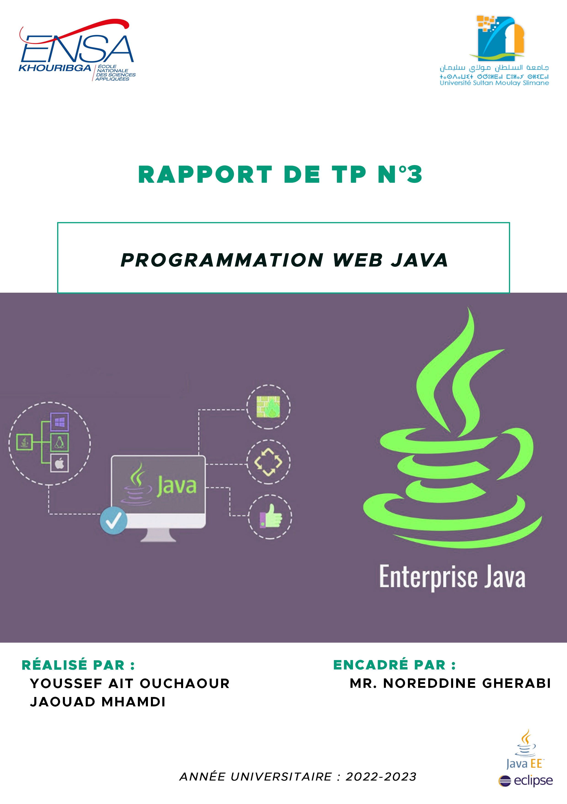
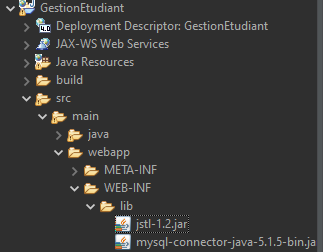
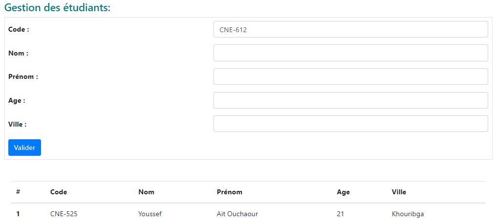

___

<h2 align="center" style="color:red">Sommaire </h2>
<span align="center">

#### ........................................... [Introduction](#cc1)  ...........................................

#### ........................................... [Solutions](#cc2)  ...........................................

#### ........................................... [Conclusion](#cc3) ...........................................

</span>

___


<h2 align="center" style="color:red" id="cc1">I. Introduction</h2>

**Dans une application web java on utilise la technologie JSP pour interpréter les règles métiers, mais afin de remplacer les scriptlets, utiliser plus de code java dans la partie front-end(JSP), et une bonne pratique de l'architecture MVC dans un application web nous utilisons JSTL (Jakarta Standard Tag Library), est un composant de JEE, et il s'agit d'une bibliothèque de balises pour les tâches courantes, comme le travail sur des fichiers XML, l'exécution conditionnelle, et les boucles.**

___ 

<h2 align="center" style="color:red" id="cc2">II. Solution de TP</h2>
 

<h4 style="color:green"><u> Préparation de l'environnement:</u></h4>

<h5 style="color:teal"> Q1, Q2 et Q3 :</h5>

* <b> Créons un nouveau projet Web  *<< GestionEtudiant >>*
* On ajout les librairies de JSTL et JDBC dans *<< WebContenent/WEB-INF/lib >>* 
  
  

* Créons une nouvelle base de données *<< DBEtudiants >>* </b> 

  


<h4 style="color:green"><u> Couche Entité:</u></h4>

<h5 style="color:teal"> Q4, Q5, Q6 et Q7 :</h5>

* <b> Créons un nouveau package *<< Entities >>* .
*  Créons dans le package Entities un nouveau classe *<< Etudiant >>* avec ses attributs.
  
*  Créons les Getters, les Setters, et les constructeurs de classe Etudiants.
*  Créons la table relationnelle *<< TEtudiant >>* dans la base de données *<< DBEtudiant >>* .</b>


> ##### Etudiant.java

 ```java
  package Entities;

  public class Etudiant {
    private String code;
    private String nom;
    private String prenom;
    private int age;
    private String ville;
    
    public String getCode() {
      return code;
    }
    public void setCode(String code) {
      this.code = code;
    }
    public String getNom() {
      return nom;
    }
    public void setNom(String nom) {
      this.nom = nom;
    }
    public String getPrenom() {
      return prenom;
    }
    public void setPrenom(String prenom) {
      this.prenom = prenom;
    }
    public int getAge() {
      return age;
    }
    public void setAge(int age) {
      this.age = age;
    }
    public String getVille() {
      return ville;
    }
    public void setVille(String ville) {
      this.ville = ville;
    }
    public Etudiant(String code, String nom, String prenom, int age, String ville) {
      super();
      this.code = code;
      this.nom = nom;
      this.prenom = prenom;
      this.age = age;
      this.ville = ville;
    }
    public Etudiant() {
      super();
    }
  }
  ``` 

<h4 style="color:green"><u> Couche Présentation:</u></h4>

<h5 style="color:teal"> Q8 :</h5>

*  Créons dans WebContenet une page jsp *<< index.jsp >>* .
 

<h5 style="color:teal"> Q9 et Q10 :</h5>

*  Créons le formulaire .


* Pour générer le code de l'etudiant sous la forme CNE-num , tel que num est entre 0 et  1000; on ajout le code suivant: 
```java
<%! public String random() {
	long a=Math.round(Math.random()*1001);
	return "CNE-"+a;
}
%>
```

et après on appel la fonction **random()** dans le input tag du **Code** pour la remplir directement.

```html
<input id="code" name="code" type="text" required="required" class="form-control" value="<%=random() %>">
```

> ##### index.jsp

```html
<%@ page language="java" contentType="text/html; charset=ISO-8859-1"
    pageEncoding="ISO-8859-1"%>
    <%@ taglib uri="http://java.sun.com/jsp/jstl/core" prefix="c" %>
    
<!DOCTYPE html>
<html>
<head>
<link rel="stylesheet" href="https://stackpath.bootstrapcdn.com/bootstrap/4.1.3/css/bootstrap.min.css">
<meta charset="UTF-8">
<title>FORM</title>

<%! public String random() {
	long a=Math.round(Math.random()*1001);
	return "CNE-"+a;
}
%>
</head>
<body>
<div class="container my-4">
        <h4 class="title" style="color: teal">Gestion des étudiants:</h4>
<form action="SaveEtudiant" method="post" class="form">
<fieldset class="border p-2">
  <div class="form-group row">
    <label for="code" class="col-5 col-form-label" style="font-weight: bold;">Code :</label> 
    <div class="col-7">
      <input id="code" name="code" type="text" required="required" class="form-control" value="<%=random() %>">
    </div>
  </div>
  <div class="form-group row">
    <label for="nom" class="col-5 col-form-label" style="font-weight: bold;">Nom :</label> 
    <div class="col-7">
      <input id="nom" name="nom" type="text" required="required" class="form-control">
    </div>
  </div>
  <div class="form-group row">
    <label for="prenom" class="col-5 col-form-label" style="font-weight: bold;">Prénom :</label> 
    <div class="col-7">
      <input id="prenom" name="prenom" type="text" required="required" class="form-control">
    </div>
  </div>
  <div class="form-group row">
    <label for="age" class="col-5 col-form-label" style="font-weight: bold;">Age :</label> 
    <div class="col-7">
      <input id="age" name="age" type="text" required="required" class="form-control">
    </div>
  </div>
  <div class="form-group row">
    <label for="ville" class="col-5 col-form-label" style="font-weight: bold;">Ville :</label> 
    <div class="col-7">
      <input id="ville" name="ville" type="text" required="required" class="form-control">
    </div>
  </div> 
<button name="valider" type="submit" class="btn btn-primary">Valider</button>
</fieldset>
</form>
</body>
</html>
```

<h4 style="color:green"><u> Couche Metier:</u></h4>

<h5 style="color:teal"> Q11 :</h5>

*  Créons un autre package **<< Metier >>** dans src .

<h5 style="color:teal"> Q12 :</h5>

*  Créons dans le package Metier la servlet **<< SaveEtudiant.java >>** .
     
*  intégrer code de récupération des données.
*  intégrer code de la connexion a la base de données.
*  intégrer code d'insetion les données.
*  intégrer code de redirection vers la page **<< index.jsp >>**.
*  intégrer code de chargement des données.


> **SaveEtudiant.java**

 ```java
package Metier;

import java.io.IOException;
import java.sql.Connection;
import java.sql.DriverManager;
import java.sql.PreparedStatement;
import java.sql.ResultSet;
import java.sql.SQLException;
import java.util.ArrayList;

import javax.servlet.ServletException;
import javax.servlet.annotation.WebServlet;
import javax.servlet.http.HttpServlet;
import javax.servlet.http.HttpServletRequest;
import javax.servlet.http.HttpServletResponse;

import Entities.Etudiant;


@WebServlet("/SaveEtudiant")
public class SaveEtudiant extends HttpServlet {
	private static final long serialVersionUID = 1L;
       
    public SaveEtudiant() {
        super();
    }


    protected void doGet(HttpServletRequest request, HttpServletResponse response) throws ServletException, IOException {
		ArrayList<Etudiant> listEtd = new ArrayList<Etudiant>();
		try {
			Class.forName("com.mysql.jdbc.Driver");
			Connection cnn;
            try {
            	cnn = DriverManager.getConnection("jdbc:mysql://localhost:3306/dbetudiants", "root", "");
    			
    			PreparedStatement ps = (PreparedStatement) cnn.prepareStatement("select * from tetudiant");
    			ResultSet rs = ps.executeQuery();
    			while (rs.next()) {
    				Etudiant e = new Etudiant();
    				e.setCode(rs.getString(1));
    				e.setNom(rs.getString(2));
    				e.setPrenom(rs.getString(3));
    				e.setAge(rs.getInt(4));
    				e.setVille(rs.getString(5));
    				listEtd.add(e);
    			}
    			rs.close();
    	         
    			cnn.close();
            } catch (SQLException e) {
                e.printStackTrace();
            }
        } catch (ClassNotFoundException e) {
            e.printStackTrace();
        }
		request.setAttribute("lst", listEtd);
		request.getRequestDispatcher("/index.jsp").forward(request, response);
	}


    protected void doPost(HttpServletRequest request, HttpServletResponse response) throws ServletException, IOException {
		String code = request.getParameter("code");
		String nom = request.getParameter("nom");
		String prenom = request.getParameter("prenom");
		int age = Integer.parseInt(request.getParameter("age"));
		String ville = request.getParameter("ville");

		 try {
			 Class.forName("com.mysql.jdbc.Driver");
			 Connection cnn;
			 try {
				 cnn = DriverManager.getConnection("jdbc:mysql://localhost:3306/dbetudiants", "root", "");
			 	java.sql.Statement stmt = cnn.createStatement();
			 	String sql = "insert into tetudiant VALUES('" + code + "','" + nom + "','" + prenom + "','" + age
					 + "','" + ville + "')";
			 	stmt.executeUpdate(sql);
			 	cnn.close();
			 } catch (SQLException e) {
				 e.printStackTrace();
			 	}
			 } catch (ClassNotFoundException e) {
				 e.printStackTrace();
			 	}
		 doGet(request, response);
	}
}
  ``` 
<h5 style="color:teal"> Q13 :</h5>

*  Affichons les données de la base de données en provenance de la base de données.

  * 
  * 
  * 

> **index.jsp**

 ```html
<div class="container my-4">
        <table class="table">
        <c:set var="i" value="${0}"/>
        
            <thead>
                <tr>
                    <th scope="col">#</th>
                    <th scope="col">Code</th>
                    <th scope="col">Nom</th>
                    <th scope="col">Prénom</th>
                    <th scope="col">Age</th>
                    <th scope="col">Ville</th>
                </tr>
            </thead>
            <tbody>
                <c:forEach var="etd" items="${lst}">
                <tr>
                    <th scope="row"><c:out value="${i+1}"/></th>
                    <td><c:out value="${etd.getCode()}"/></td>
                    <td><c:out value="${etd.getNom()}"/></td>
                    <td><c:out value="${etd.getPrenom()}"/></td>
                    <td><c:out value="${etd.getAge()}"/></td>
                    <td><c:out value="${etd.getVille()}"/></td>
                </tr>
                </c:forEach>
            </tbody>
        </table>
        </div>
</div>
  ```
<h5 style="color:teal"> Q14 et Q15:</h5>

*  Pour ajouter un lien de suppression pour pouvoir de supprimer un etudiant; il suffit d'ajouter le tag suivants:

```html
<td>
  <a href="http://localhost:8080/GestionEtudiants/DeleteEtudiant?cne=${etd.getCode()}">Delete</a>
</td>
```


 ```java
package Metier;

import java.io.IOException;
import java.sql.Connection;
import java.sql.DriverManager;
import java.sql.PreparedStatement;
import java.sql.SQLException;

import javax.servlet.ServletException;
import javax.servlet.annotation.WebServlet;
import javax.servlet.http.HttpServlet;
import javax.servlet.http.HttpServletRequest;
import javax.servlet.http.HttpServletResponse;

@WebServlet("/DeleteEtudiant")
public class DeleteEtudiant extends HttpServlet {
	private static final long serialVersionUID = 1L;
       
    public DeleteEtudiant() {
        super();
    }

	protected void doGet(HttpServletRequest request, HttpServletResponse response) throws ServletException, IOException {
	if(request.getParameter("cne")!=null) {	 
      try {Class.forName("com.mysql.jdbc.Driver");
          Connection cnn;
          try {
            cnn=DriverManager.getConnection("jdbc:mysql://localhost:3306/dbetudiants","root",""); 
          String sql="DELETE FROM tetudiant WHERE code = ?";
          
            PreparedStatement ps;
          
            ps = (PreparedStatement) cnn.prepareStatement(sql);
            ps.setString(1,request.getParameter("cne"));
            ps.executeUpdate();
            response.getWriter().println("L'etudiant "+request.getParameter("cne")+" a été supprimé avec succès !" );
          } catch (SQLException e) {
            e.printStackTrace();
          }
          }catch (Exception e) {
          e.printStackTrace();
        }
    
        }
    else{
		response.getWriter().append("Served at: ").append(request.getContextPath());
		}
	}
}

  ```


___ 

<h2 align="center" style="color:red" id="cc3">III. Conclusion</h2>

**Dans ce 3eme TP nous se familiariser avec les framework JSP et sa librairy JSTL, par créer un application web qui permet à un utilisateur d'insérer un etudiant dans une base de données MySQL.**