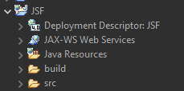
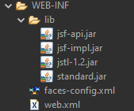
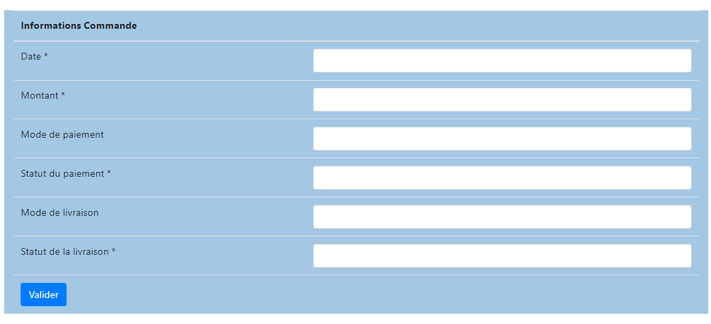
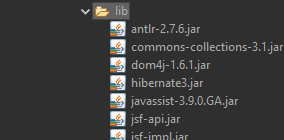
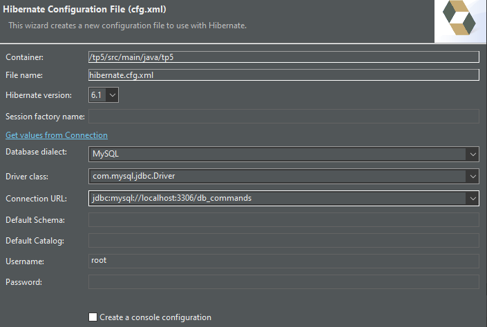

___

<h2 align="center" style="color:red">Sommaire </h2>
<span align="center">

#### ........................................... [Introduction](#cc1)  ...........................................

#### ........................................... [Solutions](#cc2)  .............................................
###### Partie I
###### Partie II
###### Partie III

#### ........................................... [Conclusion](#cc3) ............................................

</span>

___


<h2 align="center" style="color:red" id="cc1">I. Introduction</h2>

**Les applications d'entreprises s'orientent de plus en plus vers des architectures orientée service. La technologie J2EE  offre beaucoup d'outils pour répondre aux besoins modernes. et parmi cela le framework Hibernate.
et dans ce tp on va créer une application web avec jsf et Hibernate.**

___ 

<h2 align="center" style="color:red" id="cc2">II. Solution de TP</h2>
 

<h4 style="color:green"><u>I-Création d'un projet JSF:</u></h4>

<h5 style="color:teal"> Q1 :</h5>

*  Créons un nouveau projet Web  **<< JSF >>**
  
<h5 style="color:teal"> Q2 :</h5>

*  Créons l'envirennement du projet JSF(web.xml et les librairies nécessaires pour jsf).
  

<h5 style="color:teal"> Q3 :</h5>

*  Créons un nouveau fichier **index.xhtml** qui contient les tags html et Core.
  

<h5 style="color:teal"> Q4 :</h5>
   

>**index.xhtml**

```html
<?xml version="1.0" encoding="UTF-8" ?>
<!DOCTYPE html PUBLIC "-//W3C//DTD XHTML 1.0 Strict//EN" "http://www.w3.org/TR/xhtml1/DTD/xhtml1-strict.dtd">
<html xmlns="http://www.w3.org/1999/xhtml" 
      xmlns:h="http://java.sun.com/jsf/html"
      xmlns:f="http://java.sun.com/jsf/core">

<head>
    <meta http-equiv="Content-Type" content="text/html; charset=UTF-8" />
    <title>Index</title>
    <link rel="stylesheet" 
    href="https://cdn.jsdelivr.net/npm/bootstrap@4.0.0/dist/css/bootstrap.min.css"
    integrity="sha384-Gn5384xqQ1aoWXA+058RXPxPg6fy4IWvTNh0E263XmFcJlSAwiGgFAW/dAiS6JXm" 
    crossorigin="anonymous" />
</head>

<body>
  <div class="container mt-4" style="background-color:rgb(164, 199, 228)">
    <h:panelGrid columns="2" footerClass="subtitle" headerClass="subtitlebig" class="table tab-content">
      <f:facet name="header"> Informations Commande</f:facet>
      <h:outputText value="Date *" />
      <h:inputText id="date" required="true" class="form-control" />
      <h:outputText value="Montant *" />
      <h:inputText id="montant" required="true" class="form-control" />
      <h:outputText value="Mode de paiement" />
      <h:inputText id="modepaiement" required="true" class="form-control" />
      <h:outputText value="Statut du paiement *" />
      <h:inputText id="statuspaiement" class="form-control" />
      <h:outputText value="Mode de livraison" />
      <h:inputText id="modelivraison" required="true" class="form-control" />
      <h:outputText value="Statut de la livraison *" />
      <h:inputText id="statuslivraison" class="form-control" />
      <f:facet name="footer">
        <h:commandButton value="Valider" type="submit" class="btn btn-primary" />
      </f:facet>
    </h:panelGrid>
  </div>
</body>
</html>
```

<h5 style="color:teal"> Q5 :</h5>

* l'affichage de formulaire dans index.xhtml aprés l'ajout des styles de Bootstrap .



<h4 style="color:green"><u>II-Affichage, Validation et Conversion des données JSF:</u></h4>

<h5 style="color:teal"> Q6 :</h5>
   
* Valide et vérifier la saisi en respectant les contraintes suivant:
  * pour les champs marquées par <*> on ajoute :      ```required="true"``` et un message par le tag: ```requiredMessage="Veuillez saisir"```.
  * Le mode de paiement doit avoir au minimum 6 et au maximum 20 caractères : 
     ``` html
     <h:inputText id="modepaiement" required="true" class="form-control"
				requiredMessage="Veuillez saisir Mode du paiement" maxlength="20">
				<f:validateLength minimum="6" />
			</h:inputText>
     ```
  * Le nombre de caractères du champ mode livraison ne doit pas dépasser 10 caractères : 
     ``` html 
     <h:inputText id="modelivraison" required="true" class="form-control"
				requiredMessage="Veuillez saisir le Mode de livraison" maxlength="10" />
     ```
  * Le montant ne dépaase pas 20000 dh: 
     ``` html 
     <h:inputText id="montant" required="true" class="form-control" 
                  requiredMessage="Veuillez saisir le Montant">
				<f:validateDoubleRange maximum="20000" />
      </h:inputText>
     ```
  * Les messages d'erreur affiché par un style bootstrap, on ajoute le tag suivant sous chaque input tag: 
     ``` html 
     <h:message for="id_nom" style="color:red" />
     ```
    
<h4 style="color:green"><u>III-Manipulation des données a l'aide de Hibernate:</u></h4>

<h5 style="color:teal"> Q7 :</h5>
   
* On ajoute les librairies nécessaire pour Hibernate.
   

<h5 style="color:teal"> Q8 :</h5>
   
* On ajoute la class **<< Commande >>** dans src (le package tp5).
   

> **Commande.java**

```java
 package tp5;

import java.util.Date;

public class Commande {
	
  private int code;
  private Date dateCom;
  private Float montant;
  private String modeP;
  private String statusP;
  private String modeL;
  private String statusL;
  public int getCode() {
    return code;
  }
  public void setCode(int code) {
    this.code = code;
  }
  public Date getDateCom() {
    return dateCom;
  }
  public void setDateCom(Date dateCom) {
    this.dateCom = dateCom;
  }
  public Float getMontant() {
    return montant;
  }
  public void setMontant(Float montant) {
    this.montant = montant;
  }
  public String getModeP() {
    return modeP;
  }
  public void setModeP(String modeP) {
    this.modeP = modeP;
  }
  public String getStatusP() {
    return statusP;
  }
  public void setStatusP(String statusP) {
    this.statusP = statusP;
  }
  public String getModeL() {
    return modeL;
  }
  public void setModeL(String modeL) {
    this.modeL = modeL;
  }
  public String getStatusL() {
    return statusL;
  }
  public void setStatusL(String statusL) {
    this.statusL = statusL;
  }
  public Commande() { super(); }
  public Commande(int code, Date dateCom, Float montant, String modeP, 
  String statusP, String modeL, String statusL) {
    super();
    this.code = code;
    this.dateCom = dateCom;
    this.montant = montant;
    this.modeP = modeP;
    this.statusP = statusP;
    this.modeL = modeL;
    this.statusL = statusL;
  }
}
```
<h5 style="color:teal"> Q9 :</h5>
   
* Créont le fichier de configuration **hibernate.cfg.xml** a l'aide de Hibernate.
  * 

>**hibernate.cfg.xml**

```xml
<?xml version="1.0" encoding="UTF-8"?>
<!DOCTYPE hibernate-configuration PUBLIC
		"-//Hibernate/Hibernate Configuration DTD 3.0//EN"
		"http://www.hibernate.org/dtd/hibernate-configuration-3.0.dtd">
<hibernate-configuration>
    <session-factory>
        <property name="hibernate.connection.driver_class">com.mysql.jdbc.Driver</property>
        <property name="hibernate.connection.url">jdbc:mysql://localhost:3066/db_commands</property>
        <property name="hibernate.connection.username">root</property>
        <property name="hibernate.dialect">org.hibernate.dialect.MySQLDialect</property>
    </session-factory>
</hibernate-configuration>
```
<h5 style="color:teal"> Q10 :</h5>
   
* Créont le fichier de mapping **Commande.hbm.xml** a l'aide de Hibernate.
  ```xml
  <?xml version="1.0"?>
  <!DOCTYPE hibernate-mapping PUBLIC "-//Hibernate/Hibernate Mapping DTD 3.0//EN" 
  "http://hibernate.sourceforge.net/hibernate-mapping-3.0.dtd">

  <hibernate-mapping>
      <class name="Commande" table="Table_COMMANDE">
          <id name="code" type="int">
              <column name="CODE" />
              <generator class="assigned" />
          </id>
          <property name="dateCom" type="java.util.Date">
              <column name="dateCom" />
          </property>
          <property name="montant" type="java.lang.Float">
              <column name="montant" />
          </property>
          <property name="modeP" type="java.lang.String">
              <column name="modeP" />
          </property>
          <property name="statusP" type="java.lang.String">
              <column name="statusP" />
          </property>
          <property name="modeL" type="java.lang.String">
              <column name="modeL" />
          </property>
          <property name="statusL" type="java.lang.String">
              <column name="statusL" />
          </property>
      </class>
  </hibernate-mapping>
  ```
  

<h5 style="color:teal"> Q11 :</h5>
   
* On ajout dans **hibernate.cfg.xml** la propriété **hbm2ddl.auto** et le fichier de mapping **Commande.hbm.xml**.
    ```xml
      <property name="hbm2ddl.auto">update</property>    
      <mapping resource="Commande.hbm.xml"/>
    ```

<h5 style="color:teal"> Q12 :</h5>
   
* afin d'enregistrer un commande dans la base de données, charger la listes des commandes aprés; on ajoute les method suivants dans la class Commande:

>**saveCommande**

  ```java
  public void saveCommande() {
      Commande cmnd = new Commande();
      cmnd.code=this.code;
      cmnd.dateCom=this.dateCom;
      cmnd.montant=this.montant;
      cmnd.modeP=this.modeP;
      cmnd.statusP=this.statusP;
      cmnd.modeL=this.modeL;
      cmnd.statusL=this.statusL;
      SessionFactory sessionFactory = new Configuration().configure().buildSessionFactory();
      Session session = sessionFactory.openSession();
      Transaction trans = session.beginTransaction();
      trans.begin();
      session.save(cmnd);
      trans.commit();		
   }
  ```
  * on ajoute aussi une liste des commande dans Commande.java:
  ```java
    public List<Commande> Cmnds= new ArrayList<Commande>();
    public List<Commande> getCmnds() {
		return Cmnds;
    }
	public void setCmnds(List<Commande> cmnds) {
		Cmnds = cmnds;
	}
  ```
  * et pour charger la liste on ajout a saveCommande() :
    ```java
      Query q = session.createQuery("from Table_COMMANDE");
      Cmnds =q.list();
    ```

<h5 style="color:teal"> Q13 :</h5>
* Afin d'afficher les données dans la meme page on ajoute la partie suivant:

>**index.xhtml**

```html
<h:dataTable id="Commandes" value="#{commande.Cmnds}" var="cmnd" class="table table-hover">
    <h:column>
        <f:facet name="header">Code</f:facet>
        <h:outputText value="#{cmnd.code}" />
    </h:column>
    <h:column>
        <f:facet name="header">Date</f:facet>
        <h:outputText value="#{cmnd.dateCom}" />
    </h:column>
    <h:column>
        <f:facet name="header">Montant</f:facet>
        <h:outputText value="#{cmnd.montant()}">
            <f:convertNumber type="currency" currencySymbol="DH" />
        </h:outputText>
    </h:column>
    <h:column>
        <f:facet name="header">Mode de paiement</f:facet>
        <h:outputText value="#{cmnd.modeP}" />
    </h:column>
    <h:column>
        <f:facet name="header">statut du paiement </f:facet>
        <h:outputText value="#{cmnd.statusP}" />
    </h:column>
    <h:column>
        <f:facet name="header">Mode de paiement</f:facet>
        <h:outputText value="#{cmnd.modeP}" />
    </h:column>
    <h:column>
        <f:facet name="header">Mode de livraison</f:facet>
        <h:outputText value="#{cmnd.modeL}" />
    </h:column>
    <h:column>
        <f:facet name="header">statut de la livraison </f:facet>
        <h:outputText value="#{cmnd.statusL}" />
    </h:column>
</h:dataTable>
```
* pour la date en mode full:
  ```xml
  <f:convertDateTime pattern="MM/dd/yyyy" />
  ```
* le montant par le symbole DH:
  ```xml
  <f:convertNumber type="currency" currencySymbol="DH" />
  ```

<h5 style="color:teal"> Q14 :</h5>

* Pour supprimer un élément de la base de données, et charger les données après la suppression, on joute:

>deleteCommande()

```java
	public void deleteCommande() {
		
		SessionFactory sessionFactory = new Configuration().configure().buildSessionFactory();
		Session session = sessionFactory.openSession();
		Transaction trans = session.beginTransaction();
		trans.begin();
		FacesContext context = FacesContext.getCurrentInstance();
		Map<String,String> map = context.getExternalContext().getRequestParameterMap();
		int id= Integer.parseInt(map.get("code"));
		Commande c = (Commande) session.load(Commande.class, id);
		session.delete(c);
		trans.commit();
		Query q = session.createQuery("from Table_COMMANDE");
		Cmnds =q.list();
	}
```

>charge()
```java
	public void charger() {
		SessionFactory sessionFactory = new Configuration().configure().buildSessionFactory();
		Session session = sessionFactory.openSession();
		
    Query q = session.createQuery("from Table_COMMANDE");
		Cmnds =q.list();
	}
```

<h5 style="color:teal"> Q15 et Q16 :</h5>

* Dans index.xhtml on ajoute le button de suppression:

  ```xml
  <h:column>
    <f:facet name="header"><h:outputText value="Action"/></f:facet>
    <h:commandButton value="Delete" action="#{cmnd.deleteCommande()}" class="btn btn-primary"/>
  </h:column>
    ```
* La liste va s'affiche comme suit : 
   

* Lorsque on ajoute un nouveau commande.

  

* mais lorsque nous essayons d'ajouter et de supprimer une commande de la base de données, nous obtenons ce erreur, même que le code source est correct.
   
   


___ 

<h2 align="center" style="color:red" id="cc3">III. Conclusion</h2>

**Dans ce 5eme TP on se familiariser avec avec ce que nous avons appris dans jsf et découvre un nouveau framework JAVA pour la partie persistance c'est Hibernate et comment créons une application Hibernate et la configurer et lier avec la base de données.**